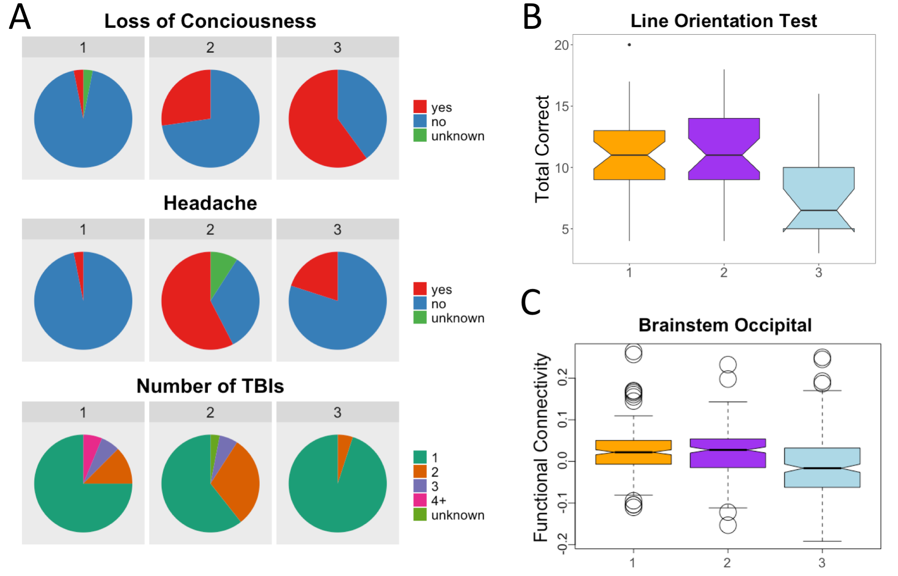

# Exploratory Data Analysis

## Replicating results of prior SNF work

Dr. Wheeler's previous SNF analyses in the Philadelphia Neurodevelopmental Cohort (PNC) identified three subtypes.
Subtype #3 was found to have a significantly higher proportion of children that experienced LOC following their injuries, significantly poorer outcomes on the line orientation test (a measure of visuospatial processing), and significantly lower functional connectivity between the brainstem and occipital cortex.

There is no equivalent assessment of the line orientation test in the ABCD study 
